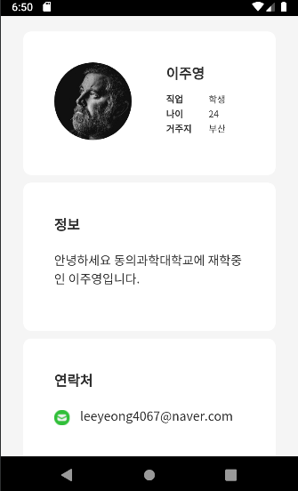
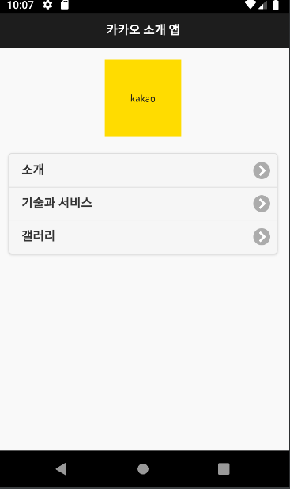
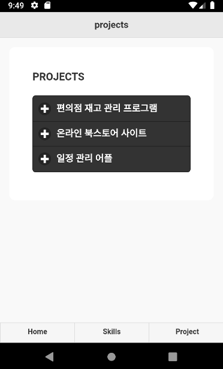

## CORDOVA 설정

1. JDK 1.8
 	

2. 아파치 앤트 설치
 

3. 안드로이드 SDK 설치
 

4. 안드로이드 플랫폼 패키지 추가 설치

* Tools
	Android SDK Tools
	Android SDK Platfor-tools
	Android SDK Build-tools
 

* Android R(Api 29, R preview)
	SDK Platform Android R Preview
	Google Play Intel x86 Atom_64_System Image
	Google APIs intel x86 Atom_64_System Image
 

* Extra
	Android Support Repository
	Google Repository
	Google USB Driver
	Intel x86 Emulator Accelerator(HAXM installer)
 

5. Node.js 설치
 

6. 폰갭 설치
>npm install -g phonegap
>npm install -g cordova
>cordova -v
>npm update -g phonegap
>npm update -g cordova

 

7. 디렉토리 설정
>mkdir HybridProject
>cd HybridProject
>cordova create test com.example.test testApp -d
>cd test
>cordova paltform add android

* AVD  혹은 스마트폰 연결
>cordova run android --list
>cordova run android

8. CDN -> 다운로드 방식으로 수정

9.  코드 추가 

## 포토폴리오
[포토폴리오](https://leeyeong4067.github.io/portfolio/) 
   

## 카카오 소개
[카카오](https://leeyeong4067.github.io/mobileApp/) 
  

## 모바일 포토폴리오
[모바일 포토폴리오](https://leeyeong4067.github.io/Mportfolio/) 
  
 
